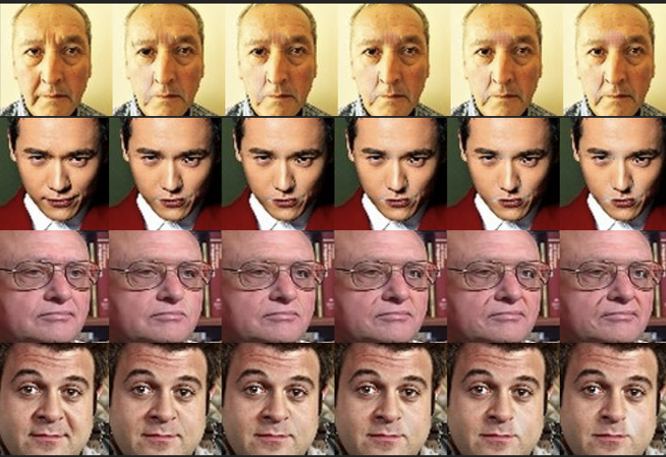

# Emogen-GANimation

Generation of facial expressions with conditional GANs based on Action Units (AUs)

[](https://www.python.org/)
[](https://pytorch.org/)
[](LICENSE)

---

## Description

Emogen-GANimation is an implementation based on the paper  
[GANimation: Anatomically-aware Facial Animation from a Single Image](https://arxiv.org/abs/1807.09251)  
(Pumarola et al., ECCV 2018).

The model uses a conditional GAN (Wasserstein GAN-GP) to generate realistic facial expressions from a single image, by manipulating the Action Units (AUs) of the FACS system (Facial Action Coding System).

---

## Why this project

This project was born from a simple conviction: reproducing a scientific paper is the most honest way to measure what one truly understands. After fifteen rejections for a master’s program, I chose not to endure but to produce. GANimation naturally imposed itself because it concentrates in a single architecture three fields that define my research interests: computer vision, deep learning, and facial expression modeling.

The objective was not simply to reproduce the results of the original paper, but to measure my ability to adapt a complex architecture to a different context, with fewer resources, a dataset entirely rebuilt from two distinct sources, and only 6 active AUs instead of 14 in the original paper. This project is part of my long-term objective to pursue a Master’s and then a PhD in the field of generative models and computer vision.

---

## Main features

- Facial expression generation controlled by 6 Action Units: AU03, AU05, AU06, AU08, AU09, AU10
- Continuous interpolation between two expressions (source → target)
- Training and testing on 128×128 face images
- Automatic checkpoint saving and GIF/JPG export of results

---

## Architecture

```
Emogen-GANimation/
├── main.py                  # Main entry point
├── options.py               # Configuration and CLI arguments
├── solvers.py               # Training and testing loop
├── visualizer.py            # Image utilities
├── model/                   # Network definitions (Generator, Discriminator)
├── data/                    # Data loading and preprocessing
│   ├── __init__.py
│   ├── base_dataset.py      # Base dataset
│   └── data_loader.py       # Custom DataLoader
├── train_ids.csv            # Training image IDs
├── test_ids.csv             # Test image IDs
├── requirements.txt         # Python dependencies
└── LICENSE                  # MIT license
```

---

## Installation

### Prerequisites

- Python 3.6+
- CUDA-compatible GPU (recommended)

### Steps

```bash
# 1. Clone the repository
git clone https://github.com/godfree12/emogen-Ganimation.git
cd emogen-Ganimation

# 2. Create a virtual environment
python -m venv venv
source venv/bin/activate  # Linux/macOS
# venv\Scripts\activate   # Windows

# 3. Install dependencies
pip install -r requirements.txt
```

### Main dependencies

| Package       | Version   | Description                    |
|---------------|-----------|--------------------------------|
| torch         | ≥ 0.4.1   | Deep learning framework        |
| torchvision   | ≥ 0.2.1   | Computer vision utilities      |
| imageio       | ≥ 2.5.0   | Image and GIF export           |
| tqdm          | ≥ 4.0     | Progress bar                   |

---

## Dataset used

This project is based on the fusion of two Kaggle datasets:

- AffectNet: 30,600 images (100×100 px)  
- RAF-DB: 15,300 images (98×98 px)

Raw total: ~35,255 images

### Preprocessing steps

1. Raw fusion of the two datasets (organized by emotion)  
2. Removal of the contempt class absent from RAF-DB  
3. AU extraction via OpenFace: 29,226 images kept, ~3,250 rejected (~10% loss)  
4. File renaming to avoid collisions (1,584 duplicates detected between train/test)  
5. Resizing to 128×128 px  
6. Final split: 19,332 train images (66%) / 9,894 test images (34%)

---

## Data preparation

### Expected dataset

The model expects a dataset organized as follows:

```
data_root/
├── imgs/                    # Folder containing face images (128x128)
│   ├── image001.jpg
│   ├── image002.jpg
│   └── ...
├── aus_openface.pkl         # Pickle dict {image_name: 6_AU_vector}
├── train_ids.csv            # Training IDs list
└── test_ids.csv             # Test IDs list
```

### Action Unit extraction

AUs are extracted with OpenFace.  
The aus_openface.pkl file contains a Python dictionary:

```python
{
    "image001.jpg": [0.12, 0.45, 0.00, 0.33, 0.71, 0.02],  # AU03, AU05, AU06, AU08, AU09, AU10
    "image002.jpg": [0.89, 0.23, 0.10, 0.05, 0.44, 0.31],
    ...
}
```

AUs used (6):
- AU03: slight brow lowering (tension / mild anger)
- AU05: upper eyelid raise (surprise / attention)
- AU06: cheek raise (smile / joy)
- AU08: slight lip compression (tension / seriousness)
- AU09: nose wrinkling (disgust)
- AU10: upper lip raise (disgust / contempt)

---

## Usage

### Training

```bash
python main.py \
    --mode train \
    --data_root /path/to/dataset \
    --batch_size 25 \
    --niter 20 \
    --niter_decay 10 \
    --lr 0.0001 \
    --gan_type wgan-gp \
    --gpu_ids 0
```

### Test / Inference

```bash
python main.py \
    --mode test \
    --data_root /path/to/dataset \
    --load_epoch 30 \
    --ckpt_dir ./ckpts/dataset/ganimation/XXXXXX \
    --interpolate_len 5 \
    --gpu_ids 0
```

### Useful options

| Argument             | Default   | Description                                      |
|----------------------|-----------|--------------------------------------------------|
| --mode               | train     | Mode: train or test                              |
| --data_root          | required  | Path to the dataset                              |
| --batch_size         | 25        | Batch size                                       |
| --niter              | 20        | Number of epochs at constant LR                  |
| --niter_decay        | 10        | Number of epochs with LR decay                   |
| --lr                 | 0.0001    | Initial learning rate (Adam)                     |
| --gpu_ids            | 0         | GPU IDs (-1 for CPU)                             |
| --interpolate_len    | 5         | Number of interpolation steps at test time       |
| --save_test_gif      | false     | Save results as GIF                              |
| --lambda_aus         | 160.0     | AU loss weight                                   |
| --lambda_rec         | 10.0      | Reconstruction loss weight                       |

---

## Result examples



---

## Current limitations

Visual artifacts and facial distortions were observed on a subset of generated images. In particular, a progressive white luminous artifact appears around the eyes, as well as an abnormal dark area around the mouth. This suggests that the model does not properly regulate the intensity of local transformations driven by the AUs.

---

## Expected results

The model produces:
- During training: generated images and attention masks
- During testing: interpolated images between the source expression and the target expression

```
Source → Interpolation 1 → ... → Interpolation N → Target
```

Results are saved in the results/ folder in JPG or GIF format.

---

## References

- Paper: GANimation: Anatomically-aware Facial Animation from a Single Image — Pumarola et al., ECCV 2018
- FACS: Facial Action Coding System — Ekman & Friesen, 1978
- Original codebase: donydchen/ganimation_replicate — Yuedong Chen, 2018

---

## Author

Godfree AKAKPO — @godfree12

---

## License

This project is under the MIT license. See the LICENSE file for more details.

---
